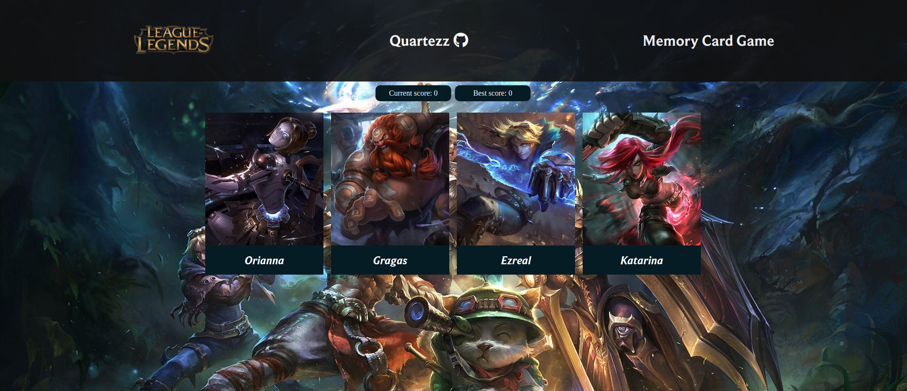

    <h1 align="center">Memory Card Game</h1>
  </a>

 

## :bell: About
A card memory game inspired by characters from the game League of Legends. The game features 40 unique characters and you have to remember them all!  
Your goal is not to click on a character already clicked once. Good luck summoner!

## Preview

# React + Vite

This template provides a minimal setup to get React working in Vite with HMR and some ESLint rules.

Currently, two official plugins are available:

- [@vitejs/plugin-react](https://github.com/vitejs/vite-plugin-react/blob/main/packages/plugin-react/README.md) uses [Babel](https://babeljs.io/) for Fast Refresh
- [@vitejs/plugin-react-swc](https://github.com/vitejs/vite-plugin-react-swc) uses [SWC](https://swc.rs/) for Fast Refresh
