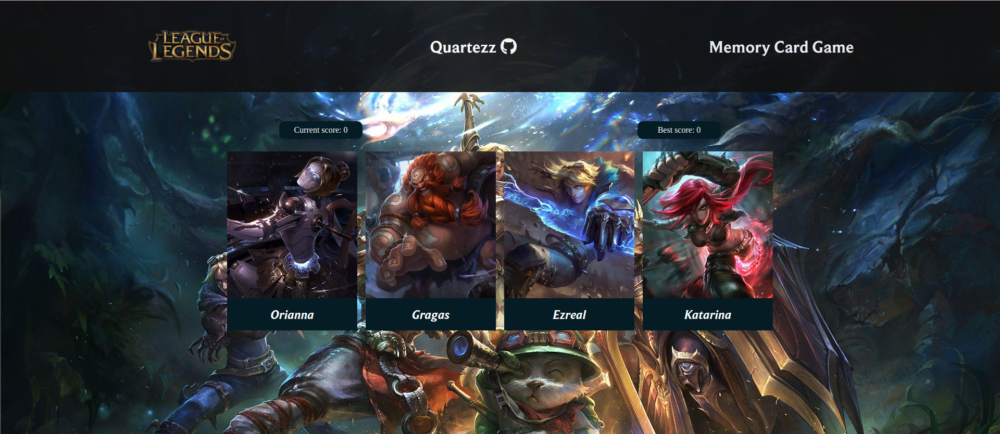

    <h1 align="center">Memory Card Game</h1>
  </a>

 

## :bell: About
A card memory game inspired by characters from the game League of Legends. The game features 40 unique characters and you have to remember them all!  
Your goal is not to click on a character already clicked once. Good luck summoner!

[Live Demo](https://quartezz.github.io/MemoryCard/)

## Preview

## :wrench: Technologies Used
- HTML
- SCSS
- JavaScript
- React
- npm
- webpack
- eslint
- babel

# React + Vite

Template of the page was created by React + Vite.
